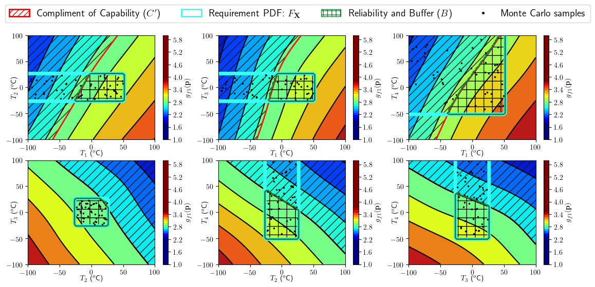
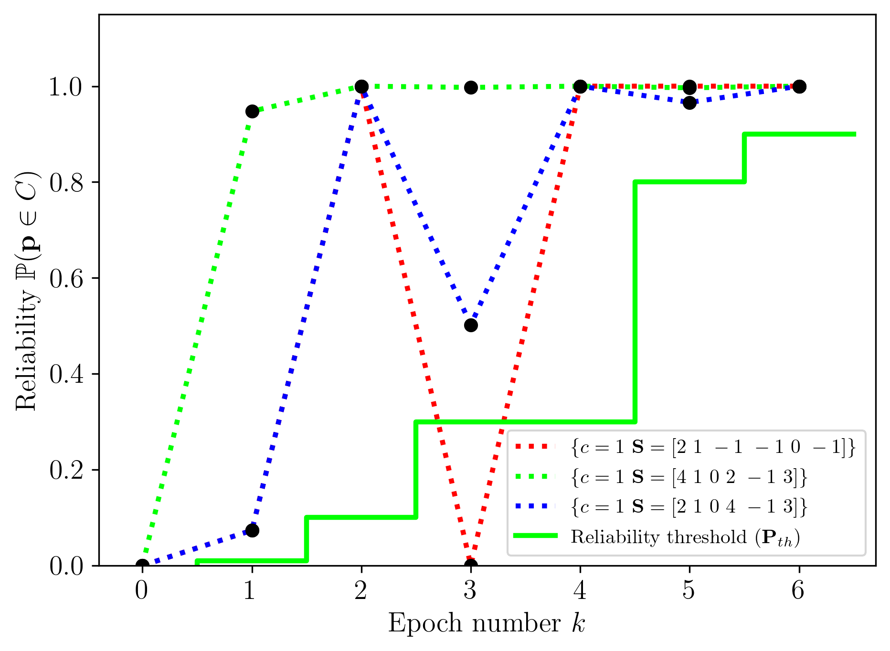
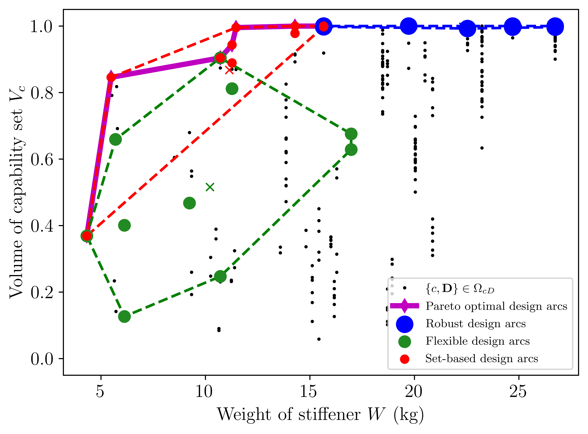
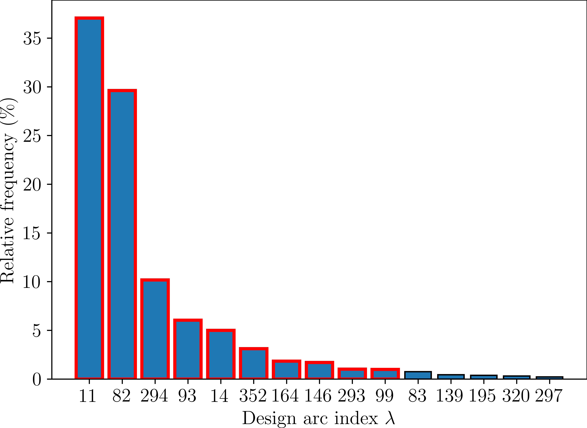
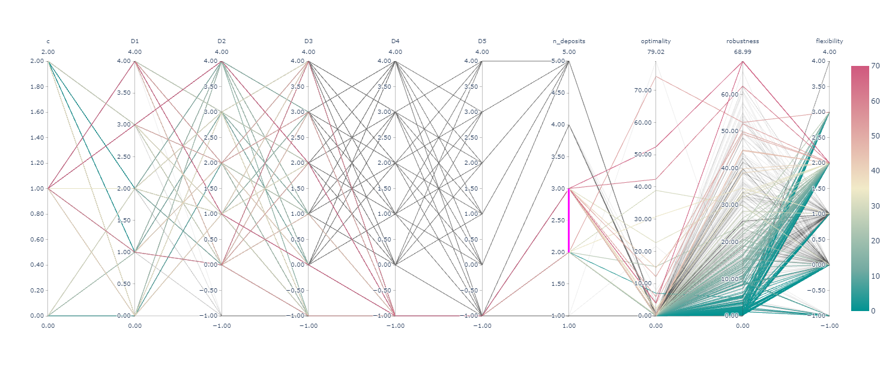

# Python design margin toolbox

After seeing [this article](https://www.cambridge.org/core/product/identifier/S2053470119000076/type/journal_article) it occurred to me that using safety factors to reduce the risk of failure of a design is inefficient. We may end up with a heavily overdesigned product that ends up defeating the purpose of being cost efficient (by being super heavy and overdesigned!). We can save a lot more weight and money by using safety margins (a combination of multiple safety factors) to find that sweet spot that balances safety and cost efficiency of a design.

I decided to create a toolbox of visualization tools for calculating the design margins for a given design problem and then try to trade it against weight (or cost) using [NOMAD](https://www.gerad.ca/nomad/), an open source optimization algorithm.

# Setup

## Dependencies 

- [**NOMAD**](https://www.gerad.ca/nomad/)
- [**SGTELIB**](https://github.com/bbopt/sgtelib)
- **Python** [3.8.3](https://anaconda.org/) or newer
	- [**pyDOE**](https://pypi.org/project/pyDOE/) 
	- [**python-csv**](https://pypi.org/project/python-csv/) 
- Microsoft [**Visual Studio 2017**](https://visualstudio.microsoft.com/downloads/) or newer
- **R** version 4.0.4
	- **R.matlab** library
	- **lhs** library

## Setting environment variables

Install [NOMAD](https://www.gerad.ca/nomad/).
Check that the `<%NOMAD_HOME_PERSONAL%>` environment variable has been set correctly by:
- Right click *This PC*, click *properties*
- Goto *Advanced system properties*
- Goto *Environment variables*
- Under user variables for "User" check that `<%NOMAD_HOME_PERSONAL%>` is set correctly

## Compiling executable files

I took the liberty of including precompiled binaries for this project. Try the examples below first.
If you can't run the examples because of binaries runtime errors try building them again from the source code

- categorical.exe
- categorical_biobj.exe
- categorical_MSSP.exe
from visual studio project files in [visual_studio](visual_studio/)

You can obtain the source code and visual studio files for sgtelib.exe, nomad.dll, and sgtelib.dll [here](https://www.gerad.ca/nomad/) 

# Example usage

## Running design margin example

Run the file [design_margins.py](design_margins.py) to compute the design margins for a problem involving 4 changing parameters *T1, T2, T3, and T4*. The threshold of what an acceptable design is shown in red and the design margins are calculated relative to this threshold. The following plot is generated at the end in [design_margins](design_margins/) folder:

## Running optimization example

Now we will try solving a problem to help use choose a design with the least weight that still meets the threshold. Run the file [plot_mads_progress.py](plot_mads_progress.py) to solve the optimization problem and display the progress of the algorithm. Results are saved in [progress](progress/). 

Run the file [plot_stage_space.py](plot_stage_space.py) to show how some designs would perform when the problem requirements change. Results are saved in [Stagespace_output](DOE_results/Stagespace_output). 

Use [gif_test.py](gif_test.py) to create the following animation:

Design optimization problem	               |  Decision optimization problem
:-------------------------:|:-------------------------:
  |  

## Running tradespace exploration study

 In [sample_requirements.py](sample_requirements.py) set `n_points = 10000` (recommended) to randomly try different design combinations and check there optimality, robustness and flexibility. The results are dumped in [DOE_results](DOE_results/)

## Plotting tradespace results

In [post_process_DOE.py](post_process_DOE.py):

To visualize provided sample data set:

- `filename_feas = 'feasiblity_log_full.log'`
- `filename_feas = 'feasiblity_log_full.log'`

To visualize newly generated data in [tradespace exploration study](#Running-tradespace-exploration-study) set:

- `filename_feas = 'feasiblity_log.log'` 
- `filename_feas = 'req_opt_log.log'`

The following plots are saved in [DOE_results](DOE_results/) along with some pie charts

Tradespace	               |  Ranking of different designs by optimality
:-------------------------:|:-------------------------:
  |  

## Interactive parallel coordinates plot of tradespace 

An interactive parallel coordinates plot will also be generated in order to check the relationship between designs in terms of flexibility, robustness, and optimality. Run the file [post_process_DOE.py](post_process_DOE.py) to obtain the following interactive tradespace plot. The interactive .html file will be saved in [DOE_results](DOE_results/)

# Further reading

Please check the following article for more information related to tradespace exploration and design margins

- *Scalable Set-Based Design Optimization and Remanufacturing for Meeting Changing Requirements* [1](https://asmedigitalcollection.asme.org/mechanicaldesign/article-abstract/143/2/021702/1085767)
- *Optimization of Design Margins Allocation When Making Use of Additive Remanufacturing* [2](https://asmedigitalcollection.asme.org/mechanicaldesign/article-abstract/143/2/021702/1085767)

